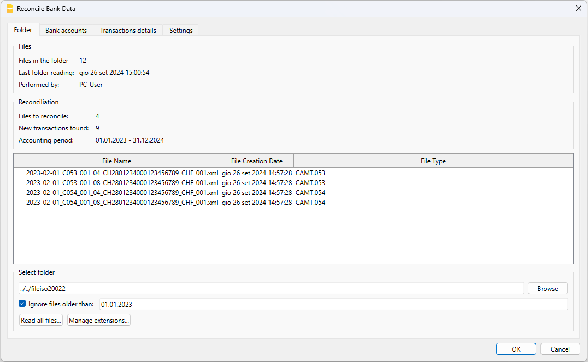
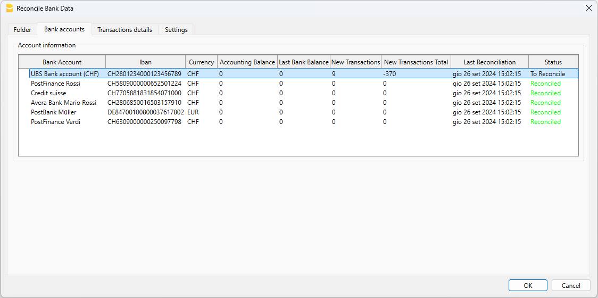
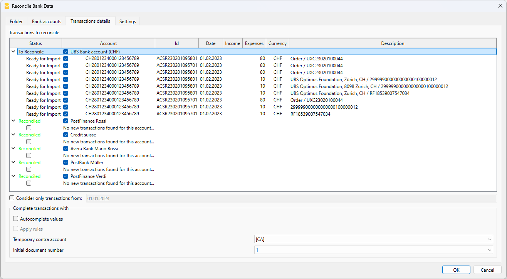

# RECONCILE BANK TRANSACTIONS WITH ACCOUNTING [BETA]

With this functionality, you can automatically reconcile bank transactions with your accounting using files in CAMT format (ISO20022). By selecting a folder containing CAMT files, the programme detects all transactions not yet recorded in the accounts and easily imports them. This feature helps you speed up the process and reduce the risk of errors or duplications.

## Prerequisites
- Using Banana Accounting Plus (Version greater than 10.1.23.24269) with the advanced plan
- Using a Double-Entry or Income and Expenses accounting.

## How to start
1) Open Banana Accounting Plus.
2) Open your accounting file or create a new one
3) if they are not already present, in the ‘Accounts’ table enter the bank accounts you intend to manage in the accounts, for each account, enter the IBAN in the 'BankIban' column also in the ‘Accounts’ table. If you do not see the 'BankIban' column in the ‘Accounts’ table, you can add it from the menu ‘Tools-->Add/Remove functionalities and select ’Add address columns in Accounts table. Make sure that the iban is written correctly, all in uppercase and without any space or character between the numbers.
4) Install the extension: "Read file to reconcile". This extension is mandatory to make the reconciliation work.
5) On menu 'Actions' click on command "Reconcile Bank Data"
6) [Select the folder where your CAMT (ISO20022) files are placed](##Folder-selection).
7) Visualize reconciliation data inside the [Reconcile Bank Data dialog](##Reconcile-Bank-Data-dialog).
8) Press OK in the dialog.
 
Once you have reconciled the transactions, if you select againg the command "Reconcile Bank Data", you should see that all the bank accounts are reconciled with the accounting.

## Folder selection
# Banana: Data Reconciliation Process

Banana performs data reconciliation starting from the selected folder. Once the folder is selected, the program begins reading the files and their contents. During this process, a dialog will show you the progress of the operation. The data reading is divided into two main steps:

1) **Reading the files in the folder**: The entire folder is scanned, and all new files are saved in the [Database](##Reconciliation -Database).
2) **Reading the content of the files**: Only files with a creation date within the accounting period are opened and read. In the [dialog](##Dialog), you can also choose to include files created before the accounting opening date by simply adjusting the [Ignore files older than](##Dialog) field.

Clicking the "Cancel" button during the data reading process does not stop the reconciliation but continues processing the data read up to that point. To resume and complete the data reading, simply select the reconciliation command again, and the program will finish processing, adding any new data to what has already been saved.

For convenience, the program automatically checks for new content in the folder every 24 hours. If you have added new files and want to force a read, you can do so by pressing the [Read all Files](##Dialog) button in the data reconciliation dialog.

All files in the folder are saved, but only ISO20022 files (camt052, camt053, and camt054) are opened and read; everything else is stored. You can create as many sub-levels of folders as you wish, and the program will search for content in each folder and subfolder.

## Reconcile Bank Data dialog

The dialogue provides an overview of the processed files, the parameters used and of course the transactions to be reconciled with the accounting. You can change the parameters in the dialogue at any time, and data processing is performed immediately.

### Folder Tab

Provides an overview of the reconciliation performed and the list of files containing transactions to be reconciled with the accounting.

In the "Select Folder" box, you can see the path of the chosen folder, and you can change it at any time. The program will immediately start processing the data in the selected folder. As explained in the [Folder selection](##Folder-selection) section, you have the option to modify the filter date for file processing, which by default is the same as the accounting opening date.

### Bank accounts Tab

The accounts tab groups the list of bank accounts appearing in the accounting. For each account, the basic account data is shown, along with some information that may vary depending on the reconciliation:

* Accounting Balance: The current balance resulting in the accounting.
* Last Bank Balance: The most recent bank balance detected from the read files.
* New Transactions: The number of new transactions found.
* New Transactions Total: The total (balance) of the transactions to be imported.
* Last Reconciliation: The date of the last complete reading of the folder containing the files.
* Status: An account can have two statuses:
   - Reconciled: No new transactions were found for this account, so it is considered reconciled.
   - To Reconcile: Some transactions were found for this account that do not exist in the accounting, so it is marked as to be reconciled.

### Transactions details Tab

Shows,grouped by account, the data for all the transactions that need to be reconciled with the accounting. You have the option to exclude specific transactions or all transactions related to a certain account by using the checkboxes, these excluded transactions will then be proposed to you again the next time you display the dialog.

For the reconciliation process, you can choose to consider only incoming transactions after a certain date. This is useful when you are sure that all the transactions in the "Transactions" table are checked and correct, and you only want to consider those after this date. This can be particularly helpful when the transactions in the accounting do not have an ID (External Reference column), which is the primary value used to determine whether a transaction exists or not. By setting the filter date to the date of the last transaction in the accounting, the program will ignore all transactions with the same or older date.

### Settings Tab

Currently, here you only have the option to delete all reconciliation data saved in the database. Once the deletion is confirmed, you will be redirected to the [Folder Tab](##Folder-Tab) and by default, you will see all values set to 0. At this point, if you want to perform a new data reconciliation, just click the "Read All Files" button.

If you just wanted to delete the database data, at this point you still need to manually delete the .db file.

The data saved in the reconciliation database has nothing to do with the data saved in Banana, and deleting the database file will not modify any data in your accounting.

## Reconciliation Database

The bank transaction reconciliation database is simply a file that is created at the same level as the folder you selected when you perform the reconciliation

The name of the file is generated using the name of the selected folder. So, if your folder containing ISO20022 camt053 files is named, for example, myIsoBankFiles, the database file will be named: **myIsoBankFiles_reconcileBankTransactionsData.db**.

This file must remain in its location and should not be moved, as the program will always look for it in the same place ( at the level of the selected file folder). If you accidentally move or delete the .db file, it is not an issue; the program will create a new one. Each time the program creates a new .db file, it will need to read the entire contents of the file folder again.

Every time you select a different folder, a new .db file is created at the same level. If you realize that the selected folder is the wrong one, you can safely delete the .db file, and the program will create a new one at the level of the new folder.

## Log file

Banana also generates a log file during the reconciliation progress, this file would be useful for the developers in case you are facing troubles with the process, to understand what went wrong.

Take contact with our support and will help you to find the file in your active directory.

## Troubleshooting
- If you dont see any transaction to import but the selected folder is correct,please check:
 * If the bank accounts inserted in the Accounts table are correct.
 * If the accounting period include the transactions contained in the files (eventually check also the date filter "Consider only transactions from") in the transactions details tab.
 * The flag "Ingore files older than" date filter.