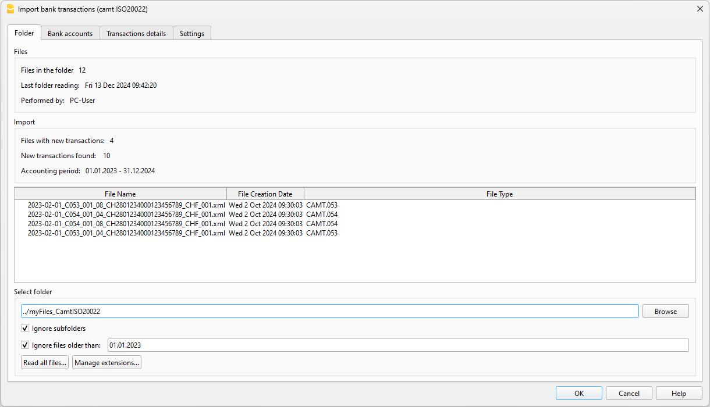

# BANKTRANSAKTIONEN IMPORTIEREN (Camt ISO20022) [BETA]

Mit dieser Funktion können Sie Banktransaktionen in Ihre Buchhaltung importieren, indem Sie Camt ISO20022-Dateien verwenden. Durch das Auswählen eines Ordners, der CAMT-Dateien enthält, erkennt das Programm alle Transaktionen, die noch nicht in den Konten erfasst sind, und importiert sie. Diese Funktion hilft Ihnen, den Prozess zu beschleunigen und das Risiko von Fehlern oder Duplikaten zu reduzieren.

## Voraussetzungen
- Verwendung von Banana Accounting Plus mit dem Advanced-Plan.
- Verwendung der doppelten Buchführung oder der Einnahmen- und Ausgabenrechnung.

## So starten Sie
1) Öffnen Sie Banana Accounting Plus.
2) Öffnen Sie Ihre Buchhaltungsdatei oder erstellen Sie eine neue.
3) Falls noch nicht vorhanden, geben Sie im ‘Konten’-Tab die Bankkonten ein, die Sie verwalten möchten. Für jedes Konto geben Sie die IBAN in der Spalte 'BankIban' ein. Wenn Sie die Spalte 'BankIban' im 'Konten'-Tab nicht sehen, können Sie sie über das Menü ‘Werkzeuge-->Funktionen hinzufügen/entfernen’ hinzufügen und 'Adressspalten im Konten-Tab hinzufügen' auswählen. Stellen Sie sicher, dass die IBAN korrekt eingegeben ist, alles in Großbuchstaben und ohne Leerzeichen oder Sonderzeichen zwischen den Buchstaben.
4) Installieren Sie die Erweiterung: "Swiss Camt ISO20022 Reader". Diese Erweiterung ist notwendig, damit der Import funktioniert.
5) Klicken Sie im Menü 'Aktionen' auf den Befehl "Banktransaktionen importieren (Camt ISO20022)".
6) [Wählen Sie den Ordner, in dem Ihre Dateien gespeichert sind](##Ordner-Auswahl).
7) Visualisieren und verwalten Sie die Daten in der [Dialogbox](##Dialog-Banktransaktionen-importieren).
8) Drücken Sie OK.

Nachdem Sie die Transaktionen importiert haben, sollten Sie, wenn Sie erneut den Befehl „Banktransaktionen importieren“ auswählen, sehen, dass alle Bankkonten auf dem neuesten Stand sind.

## Ordner-Auswahl

Wählen Sie den Ordner, der Ihre Dateien enthält. Sobald der Ordner ausgewählt ist, liest das Programm die Dateien und deren Inhalt. Während des Prozesses zeigt eine Dialogbox den Fortschritt der Operation an. Das Lesen der Daten ist in zwei Hauptschritte unterteilt:

1) **Lesen der Dateien im Ordner**: Der gesamte Ordner wird durchsucht und alle neuen Dateien werden in der [Datenbank](##Datenbank-Datei) gespeichert.
2) **Lesen des Dateiinhalts**: Es werden nur Dateien geöffnet und gelesen, deren Erstellungsdatum innerhalb des Buchhaltungszeitraums liegt. In der [Dialogbox](##Dialog) können Sie auch wählen, Dateien einzuschließen, die vor dem Eröffnungsdatum der Buchhaltung erstellt wurden, indem Sie einfach das Feld [Dateien älter als ignorieren](##Dialog) anpassen.

Wenn Sie während des Datenlesevorgangs auf die Schaltfläche "Abbrechen" klicken, werden die bis zu diesem Punkt gelesenen Daten gespeichert und verarbeitet. Um die Datenlesung fortzusetzen und abzuschließen, wählen Sie einfach erneut den Importbefehl aus und das Programm beendet die Verarbeitung, indem es neue Daten zu den bereits gespeicherten hinzufügt.

Zur Vereinfachung überprüft das Programm automatisch alle 24 Stunden, ob neue Inhalte im Ordner vorhanden sind. Wenn Sie neue Dateien hinzugefügt haben und eine manuelle Überprüfung erzwingen möchten, können Sie dies tun, indem Sie auf die Schaltfläche [Alle Dateien lesen](##Dialog) in der Import-Dialogbox klicken.

Alle Dateien im Ordner werden gespeichert, aber nur ISO20022-Dateien (camt052, camt053 und camt054) werden geöffnet und gelesen; alles andere wird gespeichert. Sie können so viele Unterordner erstellen, wie Sie möchten, und das Programm durchsucht jeden Ordner und Unterordner nach Inhalten.

## Dialogbox Banktransaktionen importieren

Die Dialogbox bietet eine Übersicht über die verarbeiteten Dateien, die verwendeten Parameter und natürlich die zu importierenden Transaktionen. Sie können die Parameter in der Dialogbox jederzeit ändern; die Daten werden sofort neu berechnet.

### Tab Ordner

Bietet eine Übersicht über den Import und die Liste der Dateien, die Transaktionen zum Importieren enthalten.

Im Feld "Ordner auswählen" können Sie den Pfad des ausgewählten Ordners sehen und diesen jederzeit ändern. Jedes Mal, wenn der Referenzordner geändert wird, wiederholt das Programm sofort den Prozess, um die Daten aus dem neuen Ordner zu lesen.

Sie können das Referenzdatum für das Lesen von Dateien ändern; Dateien mit einem Erstellungsdatum, das vor dem in diesem Feld eingegebenen Datum liegt, werden nicht gelesen. Standardmäßig entspricht das Datum dem Datum, an dem die Konten eröffnet wurden, aber Sie können es jederzeit ändern. Dieser Filter wurde für Fälle erstellt, in denen Dateien aus früheren Buchhaltungen in einem Ordner vorhanden sind und Sie nicht möchten, dass sie berücksichtigt werden.

### Tab Bankkonten

Der Tab Bankkonten gruppiert die Liste der Bankkonten, die in der Buchhaltung erscheinen. Für jedes Konto werden die grundlegenden Kontodaten angezeigt, zusammen mit einigen Informationen, die je nach Import variieren können:

* Buchhaltungssaldo: Der aktuelle Saldo, der sich aus der Buchhaltung ergibt.
* Letzter Banksaldo: Der zuletzt festgestellte Banksaldo aus den Camt-Dateien.
* Neue Transaktionen: Die Anzahl der gefundenen neuen Transaktionen.
* Neue Transaktionen Gesamt: Der Gesamtbetrag (Saldo) der zu importierenden Transaktionen.
* Letzter Import: Das Datum der letzten vollständigen Überprüfung des Ordners mit den Dateien.
* Status: Ein Konto kann zwei Status haben:
   - Auf dem neuesten Stand: Für dieses Konto wurden keine neuen Transaktionen gefunden.
   - Neue Transaktionen: Es wurden Transaktionen für dieses Konto gefunden, die in der Buchhaltung nicht vorhanden sind.

### Tab Transaktionsdetails

Zeigt, gruppiert nach Konto, die Daten aller Transaktionen an, die in die Buchhaltung importiert werden müssen. Sie haben die Möglichkeit, bestimmte Transaktionen oder alle Transaktionen, die einem bestimmten Konto zugeordnet sind, mithilfe der Kontrollkästchen auszuschließen. Diese ausgeschlossenen Transaktionen werden Ihnen beim nächsten Anzeigen der Dialogbox erneut vorgeschlagen.

Für den Importvorgang können Sie wählen, ob nur eingehende Transaktionen nach einem bestimmten Datum berücksichtigt werden sollen. Dies ist nützlich, wenn Sie sicher sind, dass alle Transaktionen in der Tabelle "Transaktionen" überprüft und korrekt sind und Sie nur diejenigen berücksichtigen möchten, die nach diesem Datum eingehen. Dies kann besonders hilfreich sein, wenn die Transaktionen in der Buchhaltung keine ID (Spalte Externe Referenz) haben, die der Hauptwert ist, der verwendet wird, um festzustellen, ob eine Transaktion existiert oder nicht. Durch das Festlegen des Filterdatums auf das Datum der letzten Transaktion in der Buchhaltung ignoriert das Programm alle Transaktionen mit demselben oder einem früheren Datum.

### Tab Einstellungen

Derzeit haben Sie hier nur die Möglichkeit, den Datenverlauf aller in der Datenbank gespeicherten Importe zu löschen. Nach der Bestätigung der Löschung werden Sie zum [Tab Ordner](##Tab-Ordner) weitergeleitet und standardmäßig sehen Sie alle Standardeinstellungen. Wenn Sie zu diesem Zeitpunkt einen neuen Import durchführen möchten, klicken Sie einfach auf die Schaltfläche "Alle Dateien lesen".

Wenn Sie nur die Daten der Datenbank löschen wollten, müssen Sie an diesem Punkt noch die Datei "*.db" manuell löschen.

Die in der Datenbank gespeicherten Daten haben nichts mit den in Banana gespeicherten Daten zu tun, und das Löschen der Datenbankdatei ändert keine Daten in Ihrer Buchhaltung.

## Datenbankdatei

Die .db-Datei, die beim ersten Import erstellt wird, ist einfach ein Speicher aller Daten, die sich auf die durchgeführten Importe beziehen. Ihr Inhalt wird bei jedem Import aktualisiert, was den Datenlesevorgang beschleunigt.

Der Name der Datei wird unter Verwendung des Namens des ausgewählten Ordners generiert. Wenn Ihr Ordner mit ISO20022 camt053-Dateien beispielsweise myFiles heißt, wird die Datenbankdatei **myFiles_importBankTransactions.db** genannt.

Diese Datei muss an ihrem Speicherort bleiben und sollte nicht verschoben werden, da das Programm sie immer am selben Ort sucht (auf der Ebene des ausgewählten Dateiordners). Wenn Sie die .db-Datei versehentlich verschieben oder löschen, ist das kein Problem; das Programm erstellt eine neue. Jedes Mal, wenn das Programm eine neue .db-Datei erstellt, muss es den gesamten Inhalt des Dateiordners erneut lesen.

Jedes Mal, wenn Sie einen anderen Ordner auswählen, wird auf derselben Ebene eine neue .db-Datei erstellt. Wenn Sie feststellen, dass der ausgewählte Ordner der falsche ist, können Sie die .db-Datei bedenkenlos löschen und das Programm erstellt eine neue auf der Ebene des neuen Ordners.

## Protokolldatei

Banana erstellt während des Importvorgangs auch eine Protokolldatei. Diese Datei kann für Entwickler nützlich sein, falls beim Importvorgang Probleme auftreten, um zu verstehen, was schiefgelaufen ist.

Kontaktieren Sie unseren Support, und wir helfen Ihnen, die Datei in Ihrem aktiven Verzeichnis zu finden.

## Fehlerbehebung
- Wenn Sie keine Transaktionen zum Importieren sehen, der ausgewählte Ordner jedoch korrekt ist, überprüfen Sie bitte:
 * Ob die in der Tabelle Konten eingegebenen Bankkonten korrekt sind.
 * Ob der Buchhaltungszeitraum die in den Dateien enthaltenen Transaktionen einschließt (überprüfen Sie ggf. auch den Datumsfilter "Nur Transaktionen ab berücksichtigen") im Tab Transaktionsdetails.
 * Den Datumsfilter "Dateien älter als ignorieren".
