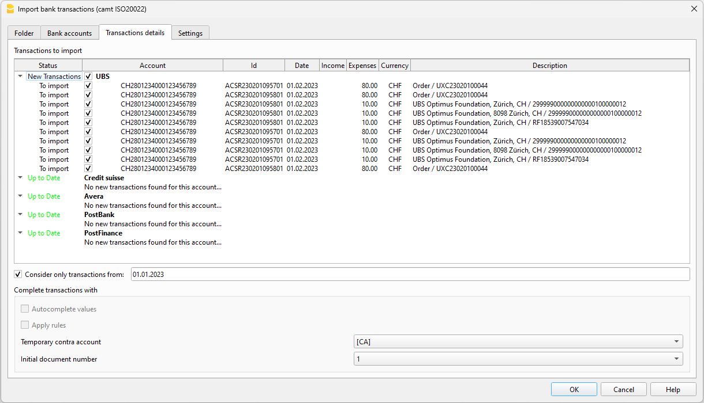

# IMPORTER LES TRANSACTIONS BANCAIRES (Camt ISO20022) [BETA]

Avec cette fonctionnalité, vous pouvez importer des transactions bancaires dans votre comptabilité en utilisant des fichiers Camt ISO20022. En sélectionnant un dossier contenant des fichiers CAMT, le programme détecte toutes les transactions qui ne sont pas encore enregistrées dans les comptes et les importe. Cette fonctionnalité vous aide à accélérer le processus et à réduire le risque d'erreurs ou de doublons.

## Prérequis
- Utilisation de Banana Accounting Plus avec le plan Advanced.
- Utilisation d'une comptabilité en partie double ou d'une comptabilité de revenus et dépenses.

## Comment commencer
1) Ouvrez Banana Accounting Plus.
2) Ouvrez votre fichier de comptabilité ou créez-en un nouveau.
3) Si ce n'est pas déjà fait, dans le tableau ‘Comptes’, entrez les comptes bancaires que vous souhaitez gérer. Pour chaque compte, entrez l'IBAN dans la colonne 'BankIban'. Si vous ne voyez pas la colonne 'BankIban' dans le tableau ‘Comptes’, vous pouvez l'ajouter à partir du menu ‘Outils-->Ajouter/Retirer des fonctionnalités’ et sélectionner ‘Ajouter des colonnes d'adresse dans le tableau Comptes’. Assurez-vous que l'IBAN est écrit correctement, en majuscules et sans espace ni caractère entre les lettres.
4) Installez l'extension : "Swiss Camt ISO20022 Reader". Cette extension est obligatoire pour que l'importation fonctionne.
5) Dans le menu 'Actions', cliquez sur la commande "Importer les transactions bancaires (Camt ISO20022)".
6) [Sélectionnez le dossier où sont placés vos fichiers](##Sélection-dossier).
7) Visualisez et gérez les données dans la [boîte de dialogue](##Boîte-de-dialogue-importer-transactions-bancaires).
8) Appuyez sur OK.

Une fois que vous avez importé les transactions, si vous sélectionnez à nouveau la commande "Importer les transactions bancaires", vous devriez voir que tous les comptes bancaires sont à jour.

## Sélection du dossier

Sélectionnez le dossier contenant vos fichiers. Une fois le dossier sélectionné, le programme lit les fichiers et leur contenu. Pendant le processus, une boîte de dialogue vous montrera la progression de l'opération. La lecture des données est divisée en deux étapes principales :

1) **Lecture des fichiers dans le dossier** : L'ensemble du dossier est scanné et tous les nouveaux fichiers sont enregistrés dans la [Base de données](##Fichier-base-de-données).
2) **Lecture du contenu des fichiers** : Seuls les fichiers dont la date de création est comprise dans la période comptable sont ouverts et lus. Dans la [boîte de dialogue](##Dialogue), vous pouvez également choisir d'inclure les fichiers créés avant la date d'ouverture de la comptabilité en ajustant simplement le champ [Ignorer les fichiers plus anciens que](##Dialogue).

En cliquant sur le bouton « Annuler » pendant le processus de lecture des données, les données lues jusqu'à ce point seront enregistrées et traitées. Pour reprendre et terminer la lecture des données, sélectionnez simplement à nouveau la commande d'importation, et le programme terminera le traitement, en ajoutant les nouvelles données à celles déjà enregistrées.

Pour plus de commodité, le programme vérifie automatiquement s'il y a du nouveau contenu dans le dossier toutes les 24 heures. Si vous avez ajouté de nouveaux fichiers et souhaitez forcer une nouvelle lecture, vous pouvez le faire en appuyant sur le bouton [Lire tous les fichiers](##Dialogue) dans la boîte de dialogue d'importation.

Tous les fichiers du dossier sont enregistrés, mais seuls les fichiers ISO20022 (camt052, camt053 et camt054) sont ouverts et lus ; tout le reste est stocké. Vous pouvez créer autant de sous-dossiers que vous le souhaitez, et le programme recherchera du contenu dans chaque dossier et sous-dossier.

## Boîte de dialogue Importer les transactions bancaires

La boîte de dialogue fournit un aperçu des fichiers traités, des paramètres utilisés et bien sûr des transactions à importer. Vous pouvez modifier les paramètres dans la boîte de dialogue à tout moment ; les données sont recalculées immédiatement.

### Onglet Dossier

Fournit une vue d'ensemble de l'importation et la liste des fichiers contenant des transactions à importer.

Dans la case "Sélectionner le dossier", vous pouvez voir le chemin du dossier choisi et vous pouvez le changer à tout moment. Chaque fois que le dossier de référence est modifié, le programme répète immédiatement le processus de lecture des données à partir du nouveau dossier.

Vous pouvez modifier la date de référence pour la lecture des fichiers ; les fichiers dont la date de création est inférieure à la date saisie dans ce champ ne seront pas lus. Par défaut, la date est égale à la date à laquelle les comptes ont été ouverts, mais vous pouvez la modifier à tout moment. Ce filtre a été créé pour les cas où des fichiers relatifs à des comptabilités passées sont présents dans un dossier et que vous ne souhaitez pas qu'ils soient pris en compte.

### Onglet Comptes bancaires

L'onglet Comptes regroupe la liste des comptes bancaires apparaissant dans la comptabilité. Pour chaque compte, les données de base du compte sont affichées, ainsi que certaines informations pouvant varier en fonction de l'importation :

* Solde comptable : Le solde actuel résultant de la comptabilité.
* Dernier solde bancaire : Le dernier solde bancaire détecté à partir des fichiers Camt.
* Nouvelles transactions : Le nombre de nouvelles transactions trouvées.
* Total des nouvelles transactions : Le total (solde) des transactions à importer.
* Dernier import : La date de la dernière lecture complète du dossier contenant les fichiers.
* Statut : Un compte peut avoir deux statuts :
   - À jour : Aucune nouvelle transaction n'a été trouvée pour ce compte.
   - Nouvelles transactions : Certaines transactions ont été trouvées pour ce compte qui n'existent pas dans la comptabilité.

### Onglet Détails des transactions

Affiche, regroupés par compte, les données de toutes les transactions devant être importées dans la comptabilité. Vous avez la possibilité d'exclure des transactions spécifiques ou toutes les transactions liées à un certain compte en utilisant les cases à cocher ; ces transactions exclues vous seront alors à nouveau proposées la prochaine fois que vous afficherez la boîte de dialogue.

Pour le processus d'importation, vous pouvez choisir de ne prendre en compte que les transactions entrantes après une certaine date. Cela est utile lorsque vous êtes sûr que toutes les transactions du tableau "Transactions" sont vérifiées et correctes, et que vous ne souhaitez prendre en compte que celles postérieures à cette date. Cela peut être particulièrement utile lorsque les transactions dans la comptabilité ne disposent pas d'un identifiant (colonne Référence externe), qui est la principale valeur utilisée pour déterminer si une transaction existe ou non. En définissant la date du filtre sur la date de la dernière transaction dans la comptabilité, le programme ignorera toutes les transactions ayant la même date ou une date antérieure.

### Onglet Paramètres

Actuellement, vous n'avez ici que l'option de supprimer l'historique des données de tous les imports enregistrés dans la base de données. Une fois la suppression confirmée, vous serez redirigé vers l'[Onglet Dossier](##Onglet-Dossier) et par défaut, vous verrez toutes les valeurs par défaut. À ce stade, si vous souhaitez effectuer un nouvel import, il vous suffit de cliquer sur le bouton "Lire tous les fichiers".

Si vous vouliez simplement supprimer les données de la base de données, à ce stade vous devez encore supprimer manuellement le fichier "*.db".

Les données enregistrées dans la base de données n'ont rien à voir avec les données enregistrées dans Banana, et la suppression du fichier de la base de données ne modifiera aucune donnée de votre comptabilité.

## Fichier base de données

Le fichier .db qui est créé lors du premier import est simplement un stockage de toutes les données relatives aux imports effectués. Son contenu est mis à jour à chaque importation, ce qui aide à accélérer le processus de lecture des données.

Le nom du fichier est généré en utilisant le nom du dossier sélectionné. Ainsi, si votre dossier contenant des fichiers ISO20022 camt053 est nommé, par exemple, myFiles, le fichier de la base de données sera nommé : **myFiles_importBankTransactions.db**.

Ce fichier doit rester à son emplacement et ne doit pas être déplacé, car le programme le recherchera toujours au même endroit (au niveau du dossier sélectionné). Si vous déplacez ou supprimez accidentellement le fichier .db, ce n'est pas un problème ; le programme en créera un nouveau. Chaque fois que le programme crée un nouveau fichier .db, il devra relire l'intégralité du contenu du dossier de fichiers.

Chaque fois que vous sélectionnez un dossier différent, un nouveau fichier .db est créé au même niveau. Si vous réalisez que le dossier sélectionné est incorrect, vous pouvez supprimer en toute sécurité le fichier .db, et le programme en créera un nouveau au niveau du nouveau dossier.

## Fichier journal

Banana génère également un fichier journal pendant le processus d'importation. Ce fichier peut être utile pour les développeurs en cas de problèmes survenant pendant le processus d'importation, afin de comprendre ce qui n'a pas fonctionné.

Contactez notre support, et nous vous aiderons à trouver le fichier dans votre répertoire actif.

## Dépannage
- Si vous ne voyez aucune transaction à importer mais que le dossier sélectionné est correct, veuillez vérifier :
 * Si les comptes bancaires insérés dans le tableau Comptes sont corrects.
 * Si la période comptable inclut les transactions contenues dans les fichiers (vérifiez éventuellement aussi le filtre de date "Ne considérer que les transactions à partir de") dans l'onglet des détails des transactions.
 * Le filtre de date "Ignorer les fichiers plus anciens que".
