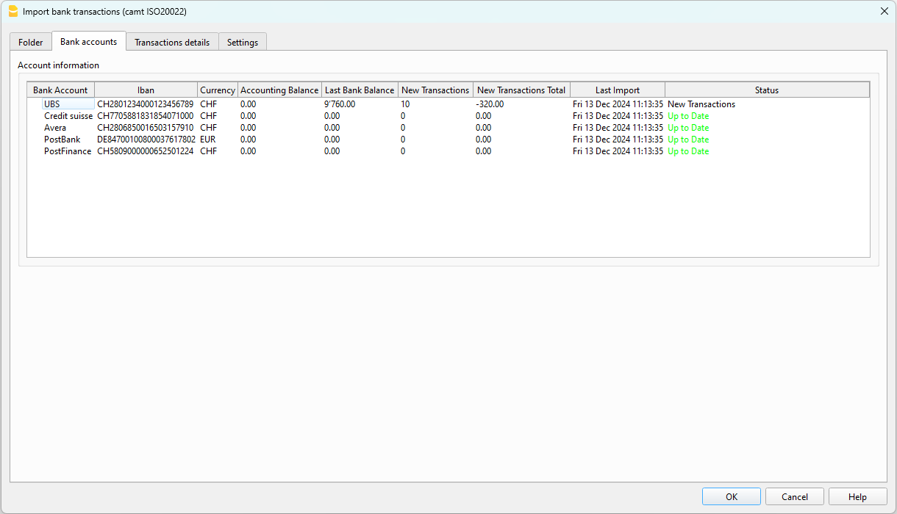

# IMPORTA TRANSAZIONI BANCARIE (Camt ISO20022) [BETA]

Con questa funzionalità, puoi importare le transazioni bancarie nella tua contabilità utilizzando i file Camt ISO20022. Selezionando una cartella contenente i file CAMT, il programma rileva tutte le transazioni non ancora registrate in contabilità e le importa. Questa funzione ti aiuta ad accelerare il processo di importazione e a ridurre il rischio di errori o duplicazioni.

## Prerequisiti
- Utilizzare Banana Accounting Plus con il piano Advanced.
- Utilizzare una contabilità a Partita Doppia o una contabilità Entrate e Uscite.

## Come iniziare
1) Apri Banana Accounting Plus.
2) Apri il tuo file di contabilità o creane uno nuovo.
3) Se non sono già presenti, nella tabella 'Conti' inserisci i conti bancari che intendi gestire. Per ogni conto, inserisci l'IBAN nella colonna 'BankIban'. Se non vedi la colonna 'BankIban' nella tabella 'Conti', puoi aggiungerla dal menu 'Strumenti --> Aggiungi/Rimuovi funzionalità' e selezionare 'Aggiungi colonne indirizzo nella tabella Conti'. Assicurati che l'IBAN sia scritto correttamente, tutto in maiuscolo e senza spazi o caratteri tra i caratteri.
4) Installa l'estensione: "Swiss Camt ISO20022 Reader". Questa estensione è obbligatoria per far funzionare l'importazione.
5) Nel menu 'Azioni', fai clic sul comando "Importa transazioni bancarie (Camt ISO20022)".
6) [Seleziona la cartella in cui sono posizionati i tuoi file](##Selezione-cartella).
7) Visualizza e gestisci i dati nella [finestra di dialogo](##Finestra-di-dialogo-importa-transazioni-bancarie).
8) Premi OK.

Una volta importate le transazioni, se selezioni nuovamente il comando "Importa transazioni bancarie", dovresti vedere che tutti i conti bancari sono aggiornati.

## Selezione cartella

Seleziona la cartella contenente i tuoi file; una volta selezionata, il programma leggerà i file ed il loro contenuto. Durante il processo, una finestra di dialogo ti mostrerà i progressi dell'operazione. La lettura dei dati è divisa in due fasi principali:

1) **Lettura dei file nella cartella**: L'intera cartella viene scansionata e tutti i nuovi file vengono salvati nel [Database](##File-Database).
2) **Lettura del contenuto dei file**: Vengono aperti e letti solo i file con una data di creazione compresa nel periodo contabile. Nella [finestra di dialogo](##Dialogo), puoi anche scegliere di includere file creati prima della data di apertura della contabilità semplicemente regolando il campo [Ignora file più vecchi di](##Dialogo).

Facendo clic sul pulsante "Annulla" durante il processo di lettura dei dati, verranno salvati ed elaborati i dati letti fino a quel momento. Per riprendere e completare la lettura dei dati, basta selezionare nuovamente il comando di importazione e il programma terminerà l'elaborazione, aggiungendo eventuali nuovi dati a quelli già salvati.

Per comodità, il programma verifica automaticamente la presenza di nuovi contenuti nella cartella ogni 24 ore. Se hai aggiunto nuovi file e vuoi forzare una lettura, puoi farlo premendo il pulsante [Leggi tutti i file](##Dialogo) nella finestra di dialogo di importazione.

Tutti i file nella cartella vengono salvati, ma solo i file ISO20022 (camt052, camt053 e camt054) vengono aperti e letti; tutto il resto viene archiviato. Puoi creare quanti livelli di sottocartelle desideri e il programma cercherà i contenuti in ciascuna cartella e sottocartella.

## Dialogo Importa transazioni bancarie

La finestra di dialogo fornisce una panoramica dei file elaborati, dei parametri utilizzati e, naturalmente, delle transazioni da importare. Puoi modificare i parametri nella finestra di dialogo in qualsiasi momento, e i dati vengono ricalcolati immediatamente.

### Scheda Cartella

Fornisce una panoramica dell'importazione e l'elenco dei file contenenti transazioni da importare.

Nella casella "Seleziona cartella", puoi vedere il percorso della cartella selezionata e puoi cambiarlo in qualsiasi momento. Ogni volta che la cartella di riferimento viene cambiata, il programma ripete immediatamente il processo di lettura dei dati dalla nuova cartella.

Puoi cambiare la data di riferimento per la lettura dei file; i file con una data di creazione inferiore alla data inserita in questo campo non vengono letti. Per impostazione predefinita, la data è uguale alla data di apertura della contabilità, ma puoi cambiarla in qualsiasi momento. Questo filtro è stato creato per quei casi in cui sono presenti file relativi a contabilità passate in una cartella e non desideri che vengano presi in considerazione.

### Scheda Conti bancari

La scheda dei conti raggruppa l'elenco dei conti bancari presenti nella contabilità. Per ogni conto vengono mostrati i dati base del conto, insieme ad alcune informazioni che possono variare in base all'importazione:

* Saldo contabile: Il saldo attuale risultante nella contabilità.
* Ultimo saldo bancario: L'ultimo saldo bancario rilevato dai file Camt.
* Nuove transazioni: Il numero di nuove transazioni trovate.
* Totale nuove transazioni: Il totale (saldo) delle transazioni da importare.
* Ultima importazione: La data dell'ultima lettura completa della cartella contenente i file.
* Stato: Un conto può avere due stati:
   - Aggiornato: Nessuna nuova transazione trovata per questo conto.
   - Nuove transazioni: Sono state trovate alcune transazioni per questo conto che non esistono nella contabilità.

### Scheda Dettagli transazioni

Mostra, raggruppati per conto, i dati di tutte le transazioni che devono essere importate nella contabilità. Hai la possibilità di escludere transazioni specifiche o tutte le transazioni relative a un determinato conto utilizzando le caselle di controllo; queste transazioni escluse verranno quindi riproposte la prossima volta che visualizzi la finestra di dialogo.

Per il processo di importazione, puoi scegliere di considerare solo le transazioni in entrata dopo una certa data. Questo è utile quando sei sicuro che tutte le transazioni nella tabella "Transazioni" siano controllate e corrette e vuoi considerare solo quelle successive a questa data. Questo può essere particolarmente utile quando le transazioni nella contabilità non hanno un ID (colonna Riferimento esterno), che è il valore principale utilizzato per determinare se una transazione esiste o meno. Impostando la data del filtro alla data dell'ultima transazione nella contabilità, il programma ignorerà tutte le transazioni con la stessa data o precedente.

### Scheda Impostazioni

Attualmente, qui hai solo l'opzione di eliminare la cronologia dei dati di tutte le importazioni salvate nel database. Una volta confermata l'eliminazione, verrai reindirizzato al [Scheda Cartella](##Tab-Cartella) e per impostazione predefinita vedrai tutti i valori predefiniti. A questo punto, se desideri eseguire una nuova importazione, basta fare clic sul pulsante "Leggi tutti i file".

Se desideravi solo eliminare i dati del database, a questo punto dovrai ancora eliminare manualmente il file "*.db".

I dati salvati nel database  non hanno nulla a che fare con i dati salvati in Banana, ed eliminare il file del database non modificherà alcun dato nella tua contabilità.

## File Database

Il file .db che viene creato durante la prima importazione è semplicemente uno storage di tutti i dati relativi alle importazioni effettuate; il suo contenuto viene aggiornato ad ogni importazione e questo aiuta a velocizzare il processo di lettura dei dati.

Il nome del file viene generato utilizzando il nome della cartella selezionata. Quindi, se la tua cartella contenente i file ISO20022 camt053 si chiama, ad esempio, myFiles, il file del database si chiamerà: **myFiles_importBankTransactions.db**.

Questo file deve rimanere nella sua posizione e non deve essere spostato, poiché il programma lo cercherà sempre nello stesso posto (a livello della cartella selezionata). Se per errore sposti o elimini il file .db, non è un grande problema; il programma ne creerà uno nuovo. Ogni volta che il programma crea un nuovo file .db, dovrà leggere nuovamente l'intero contenuto della cartella dei file.

Ogni volta che selezioni una cartella diversa, viene creato un nuovo file .db allo stesso livello. Se ti accorgi che la cartella selezionata è quella sbagliata, puoi tranquillamente eliminare il file .db e il programma ne creerà uno nuovo a livello della nuova cartella.

## File di log

Banana genera anche un file di log durante il processo di importazione, questo file può essere utile per gli sviluppatori nel caso in cui si verifichino problemi con il processo di importazione, per capire cosa è andato storto.

Contatta il nostro supporto e ti aiuteremo a trovare il file nella tua directory attiva.

## Risoluzione dei problemi
- Se non vedi alcuna transazione da importare ma la cartella selezionata è corretta, controlla:
 * Se i conti bancari inseriti nella tabella Conti sono corretti.
 * Se il periodo contabile include le transazioni contenute nei file (eventualmente controlla anche il filtro data "Considera solo transazioni da") nella tabella dei dettagli delle transazioni.
 * Il filtro data "Ignora file più vecchi di".
