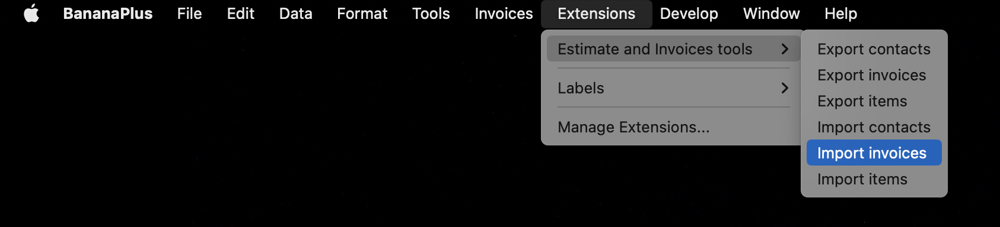

# Estimates and Invoices Tools

The extension Estimates and Invoices tools implements different functionalities used with the [Estimates and incoices application](https://www.banana.ch/doc/en/node/9752).

The following functionalities are currently implemented:

- Import 
  - Invoices
  - Contacts
  - Items
- Export
  - Invoices
  - Contacts
  - Items

The extention's menu would look like:



## Folder structure

The extension consists of the following files:

- README.md: this file
- CMakeLists.txt: project file
- src/invoice_tools.qrc: resource file to build the extension's package
- src/invoice_tools.manifest.json: manifest file with the extention's descriptions
- src/export_contacts.js: script for exporting contacts
- src/export_invoices.js: script for exporting invoices
- src/export_items.js: script for exporting items
- src/import_contacts.js: script for importing contacts
- src/import_invoices.js: script for importing invoices
- src/import_items.js: script for importing items
- src/changelog.md: cronology of modifications
- src/translations/*.ts: translataions files
- doc/*.md: documentation
- test/: folder with test units

## Import and export file format

The import and export files are csv (coma separated values) files, where:

- Values are separated by a "," (comma).
- Text values are delimited by quotes '"'.
- Text values can't contains quotes, quotes are replaced by apos '`'.
- Dates value are in ISO format "2022-10-24" (yyyy-MM-dd).
- Amount values have a dot "." as decimal separator, and no thousand separator.

### Invoice columns

- InvoiceNumber 2)
- InvoiceDate *
- InvoiceDueDate
- InvoiceDescription
- InvoiceCurrency
- InvoiceAmountType 3)
- InvoiceDiscount
- InvoiceTotalToPay 1) 6)
- InvoiceVatTotal 1) 6)
- CustomerNumber *
- CustomerName 1) 4)
- ItemNumber
- ItemDescription *
- ItemQuantity
- ItemUnitPrice
- ItemUnit
- ItemVatRate
- ItemVatCode
- ItemDiscount
- ItemTotal * 5)
- ItemVatTotal 1)

Notes:

- *\) Required fields
- 1\) Not used for import  
- 2\) By import will be replaced  
- 3\) vat_excl, vat_incl, vat_none (default is vat_excl)  
- 4\) it contains the Organisation Name or the First and Last Name plus the Locality separated by a comma  
- 5\) ItemTotal contains the total exclusive vat if InvoiceAmountType is vat_excl, otherwise it contains the total inclusive vat
- 6\) This value is used to check if after the importation the amounts corresponds

Example:

```csv
InvoiceDate,CustomerNumber,ItemDescription,ItemTotal,ItemVatRate,ItemVatTotal
2022-10-24,120001,"Red roses",100.00,V77,7.70
2022-10-24,120001,"White tulips",20.00,V77,1.54
2022-10-25,120002,"Garofani",12.00,V77,V77,0.92
2022-10-25,120002,"Rododendrus",20.00,V77,1.54
```

Import rules:

- The invoice number will be replaces with an internal invoice number.
- If the customer number doesn't exist an error is retuned.
- If the item number doesn't exist an error is retuned.
- If the vat code doesn't exist an error is retuned.
- If a required field is missind an error is retuned.
- If any field doesn't match the format an error is retuned.
- In case of any error no invoice is imported. The user have first to fix the error in the file to import, and then import again the file.
- The returned result is a [DocumentChange document](https://www.banana.ch/doc/en/node/9641)
- The DocumentChange file contains the field to be inserted in the Invoices table and the [Invoice in json format](https://www.banana.ch/doc/en/node/8833).

Export rules:

- All avalilabels columns are exported;

## Contacts columns

- Number *
- OrganisationName *
- OrganisationUnit
- NamePrefix
- FirstName *
- LastName *
- Street *
- AddressExtra
- POBox
- PostalCode *
- Locality *
- CountryCode *
- LanguageCode
- EmailWork
- Discount

Notes:

- *\) Required fields

Import rules:

- If an item with the same id exists an error is retuned.
- If a required field is missing an error is retuned.
- If any field doesn't match the format an error is retuned.
- In case on any error no item is imported. The user have first to fix the error in the file to import, and then import again the file.
- The returned result is a [DocumentChange document](https://www.banana.ch/doc/en/node/9641)
- The DocumentChange file contains the field to be inserted in the Contacts table.

Export rules:

- All avalilabels columns are exported;
- If 'OrganisationName' is present, the fields 'FirstName' and 'LastName' are not mandatory, if is not present 'FirstName' and 'LastName' are required.

## Items columns

- Number *
- Description *
- UnitPrice *
- AmountType 1)
- Unit
- VatCode
- VatRate
- Discount

Notes:

- *\) Required fields
- 1\) vat_excl, vat_incl, vat_none (default is vat_excl)

Import rules:

- If a contact with the same id exists an error is retuned.
- If any field doesn't match the format an error is retuned.
- In case on any error no contacts is imported. The user have first to fix the error in the file to import, and then import again the file.
- The returned result is a [DocumentChange document](https://www.banana.ch/doc/en/node/9641)
- The DocumentChange file contains the field to be inserted in the Items table.

Export rules:

- All avalilabels columns are exported;

## Tests

Tests are implemented following the [BananaApp Test Framework](https://www.banana.ch/doc/en/node/9026). The functionnalities are to be implemented so that test cases can be implmeneted without efforts.

For each functionality a separated test have to be implemented:

- test/ch.banana.application.invoice.export.contacts.test.js: test for exporting contacts
- test/ch.banana.application.invoice.export.invoices.test.js: test for exporting invoices
- test/ch.banana.application.invoice.export.items.test.js: test for exporting items
- test/ch.banana.application.invoice.import.contacts.test.js: test for importing contacts
- test/ch.banana.application.invoice.import.invoices.test.js: test for importing invoices
- test/ch.banana.application.invoice.import.items.test.js: test for importing items

Test input test data is placed under:

- test/testcases

Test exprected results are placed under:

- test/testexpected

To run the tests with vscode see the document [Seutup environment](doc/setupenv.md)
